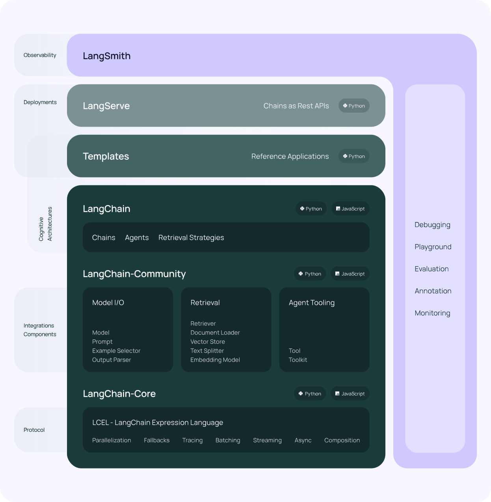

# LangChain

- a framework that allows us to build applications using LLM.

- Link: https://python.langchain.com/v0.2/docs/introduction/

- 3 main concepts in Langchain
    1. **Components**
        - **LLM Wrappers**: allow us to connect to a LLM like GPT-4, HuggingFace.
        - **Prompt Templates**: allow us to avoid hardcoding text which is the input to LLMs.
        - **Indexes for information retrieval**: allow us to extract relevant information for the LLMs.

    2. **Chains**: allow us to combine multiple components mentioned above to solve specific tasks and build entire applications.

    3. **Agents**: allow LLM to interact with its environment and external APIs. 

---

- 

---

- **RAG (Retrieval Augmented Generation)** : is about querying from different data sources. The idea is to feed documents that can be in different formats to the LLM and then we can get back the information from LLM by asking questions.
  1. Load Data Source / Data Ingestion : we basically load our data (can be in any format) from a source location, then we perform some transformation and convert the data into smaller chunks, also called as Context size. Finally go embed, meaning how we can convert all these data chunks into vectors. 
  2. Vector Store: the embedded data is stored in the Vector store/database.
  3. Retrieve most similar: when we ask questions to the LLM it will query the vector store to find the most relevant information.
